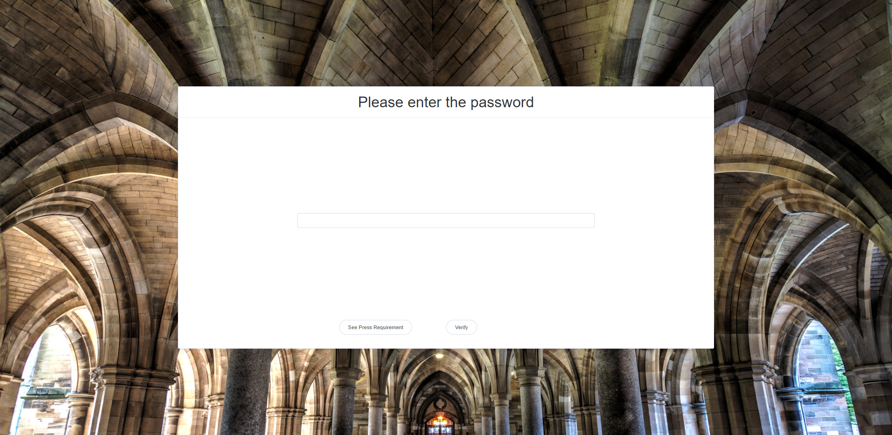
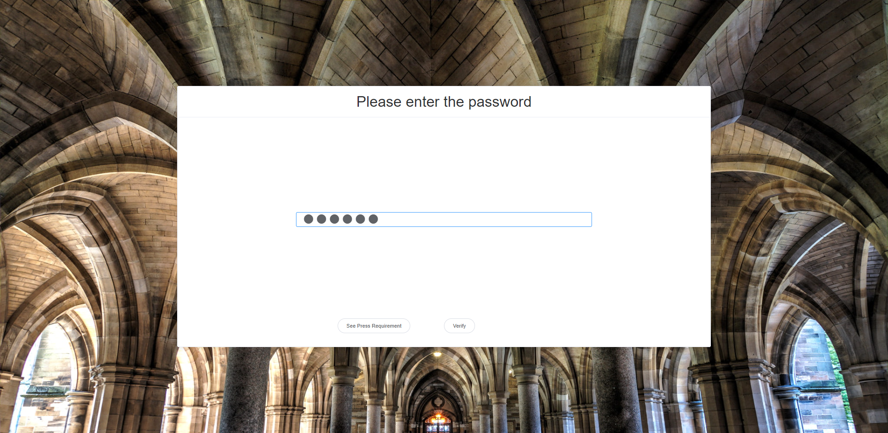
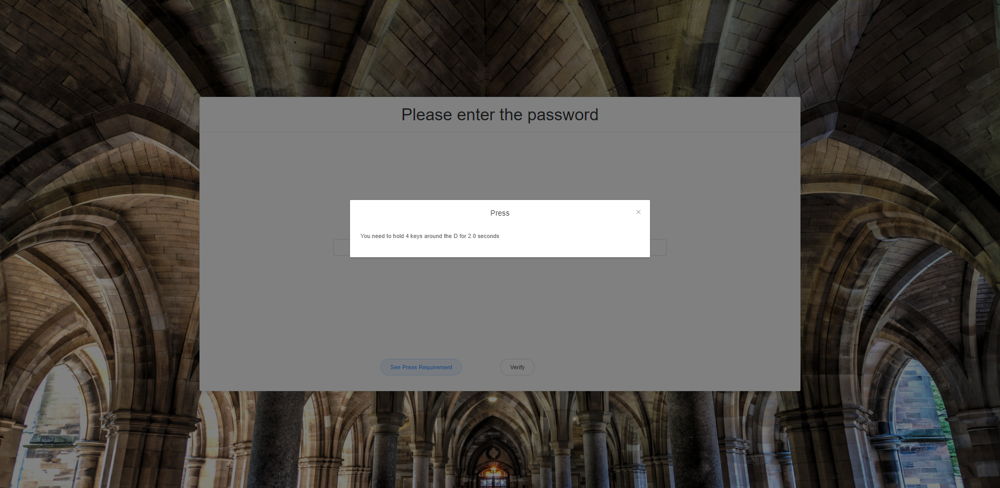
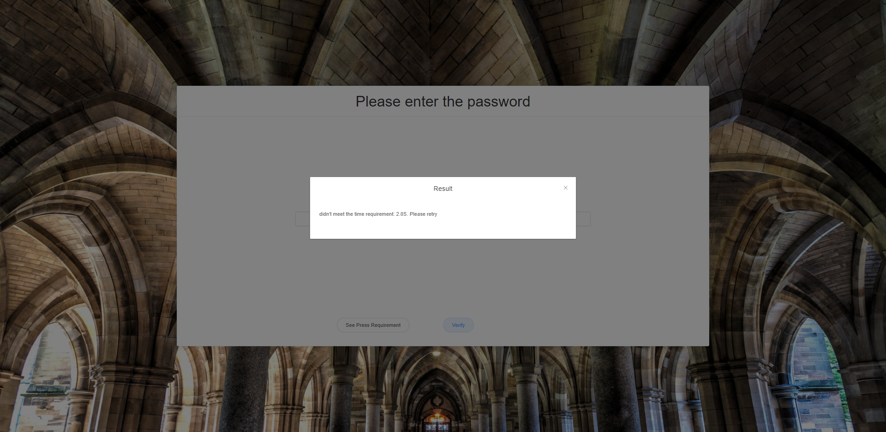
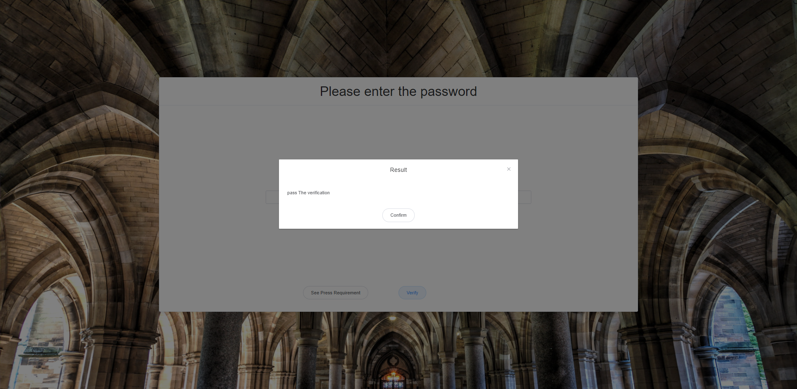

# HCS project

## Running environment

    Java 1.8 - 17
    MacOS 13+
    NodeJs v14+

## Running process for java programm

    1. Direct run KeyPressed.
    2. Start enter the password. After you finish the entering,
    there will be a notification tell you which keyboard key you
    need to press and the time for pressing.
    3. If you pass the verification, the program will you tell you pass.
    Otherwise, it will show the reason for fail.
    4. If you fail, the system will automatically run for next turn.

## Running process for webpage (frontend)

    1. in current path, get command window, run the following codes
    2. npm install
    3. npm run build
    4. npm run serve

# One example for running

This is the starting page after you run the webpage process.

Then you enter your password here.

Next, you press the enter, then click the "See Press Requirement" button. And you will follow the instruction shown.
Here is an example for instruction.

After you hold certain keys on the keyboard for certain time, you should click the "Verify" button to see if you pass the verification for the previous instruction.

If you did not hold for certain time, here will be the verify result.

If you did not hold for certain number of keys, here will be the verify result.

If you pass the verification, here will be the verify result.

After you pass the verification, there will be a "Congratulations" for you.

